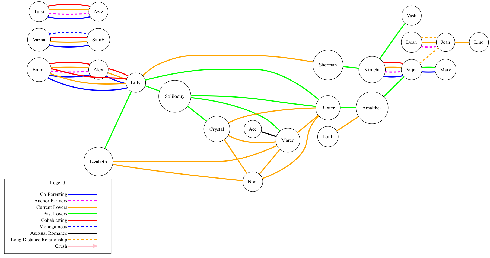

# graphviz-polycule
An example for generating a graphical representation of complicated interpersonal relationship structures using the graphviz tools. Example data taken from the webcomic [Kimchi Cuddles](http://kimchicuddles.com).

